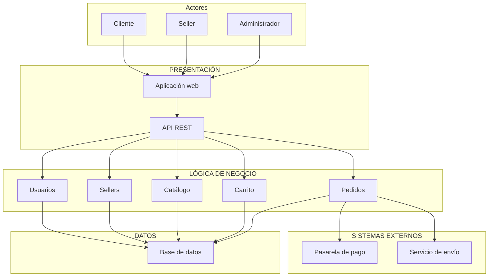

# Arquitectura inicial del sistema

## Organización en tres capas

| Capa | Responsabilidad | Elementos |
|---|---|---|
| Presentación | Permitir que los usuarios interactúen con el marketplace. | Aplicación web y API REST. |
| Lógica de negocio | Ejecutar las funciones y reglas del marketplace. | Usuarios, sellers, catálogo, carrito y pedidos. |
| Datos | Almacenar y consultar la información del sistema. | Base de datos. |

El cliente, el seller y el administrador interactúan mediante la aplicación web. Las solicitudes llegan a los módulos de lógica de negocio a través de la API REST. Estos módulos consultan o guardan información en la base de datos.

El sistema también se relaciona con una pasarela de pago y un servicio de envío externos para completar las operaciones asociadas a los pedidos.

## Diagrama de arquitectura

## Descripción del diagrama

Los actores utilizan la aplicación web, que se comunica con los módulos del sistema mediante la API REST. Los módulos de lógica de negocio consultan y almacenan información en la base de datos. El módulo de pedidos se integra con la pasarela de pago y el servicio de envío.
