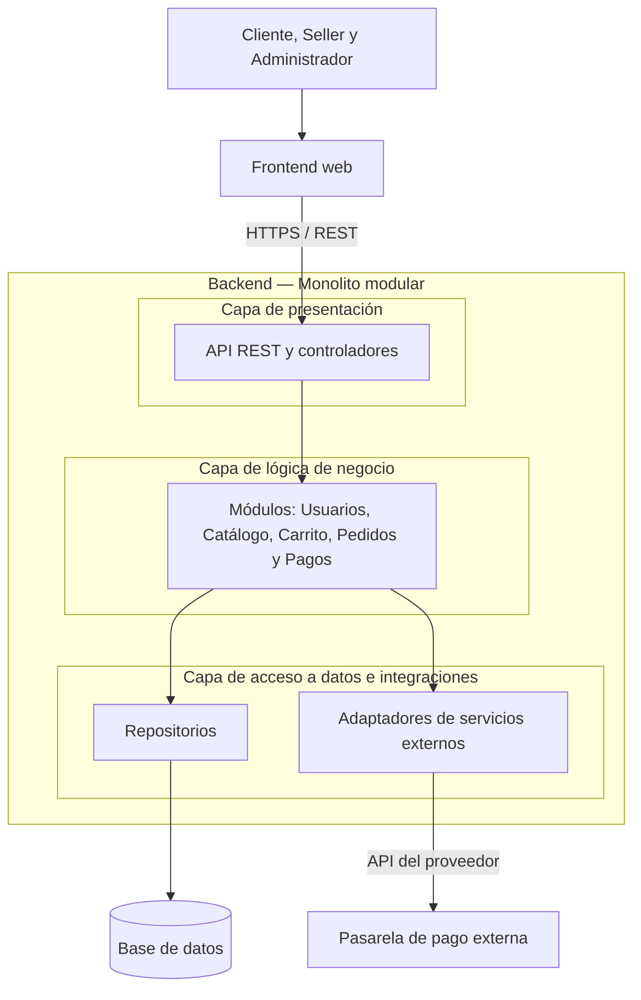

## Diagrama del estilo arquitectónico

El backend utiliza un estilo monolítico modular: sus módulos y capas forman parte de una misma aplicación y se despliegan juntos.

La organización por capas separa las siguientes responsabilidades:

- **Presentación:** recibe las solicitudes del frontend mediante la API REST.
- **Lógica de negocio:** aplica las reglas y coordina las operaciones de los módulos.
- **Acceso a datos e integraciones:** gestiona la persistencia y la comunicación con servicios externos.

El frontend, la base de datos y la pasarela de pago se encuentran fuera del monolito del backend. Las flechas representan llamadas entre componentes de la arquitectura propuesta.